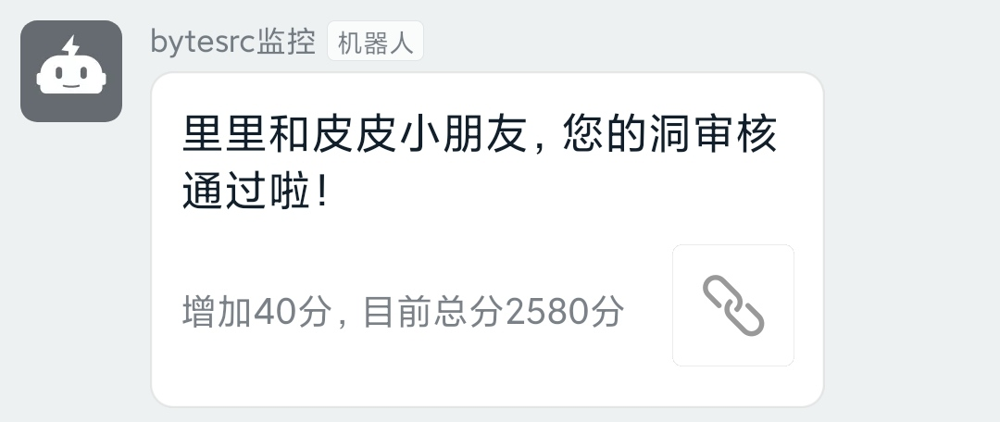

# rank_bytesrc
ByteSRC漏洞审核实时监控



### Usage
根据自己的设置替换`xxx`
 - 设置ByteSRC登录Cookie
 - 修改钉钉机器人WebHook地址和"加签"
 - 请求频率默认为10分钟一次，可修改：schedule.every(10).minutes.do(job)

Linux命令后台运行
```
nohup python3 rank_bytesrc.py &
```
